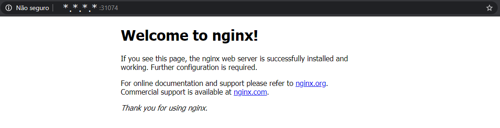

# Deploy de uma Aplicação
Vamos usar em nosso estudo de caso a instalação do nginx.

Conteúdo:
* [Instalação simples](#instalação-simples)
* [Instalação usando arquivo de configuração](#instalação-usando-arquivo-de-configuração)
* [Service](#service)
* [Réplicas](#réplicas)
* [Pods](#pods)
* [LoadBalancer](#LoadBalancer)
* [Dry-run](#dry-run)
* [Export](#export)
* [Removendo deployments](#removendo-deployments)

## Instalação simples
~~~sh
# Observação: Nesta sessão todos os comandos precisam ser executados com usuário não root/su

# Create a new deployment, which is a Kubernetes object, which will deploy an application in a container. Verify it is running and the desired number of containers matches the available.
kubectl create deployment nginx --image=nginx

# View and describe number containers
kubectl get deployments
kubectl describe deployment nginx

# View the basic steps the cluster took in order to pull and deploy the new application. You should see several lines of output. The first column shows the age of each message. Over time older messages will be removed.
kubectl get events

# Imagine que você possui uma aplicação executando em seu cluster e vc que recuperar as configurações. Isso é fácil, basta utilizar o comando
kubectl get deployment nginx -o yaml

# Agora você deve estar pensando. E como que salvo estas informações em um arquivo?
# A resposta está aqui
kubectl get deployment nginx -o yaml > first.yaml

# Para visualizar o resultado execute
vim first.yaml
~~~

## Instalação usando arquivo de configuração
~~~sh
# Observação: Nesta sessão todos os comandos precisam ser executados com usuário não root/su

# Vamos remover o deployment anterior
kubectl delete deployment nginx

# E vamos realizar novo deployment usando o *.yaml
kubectl create -f first.yaml

# Look at the yaml output of this iteration and compare it against the first. The time stamp, resource version and uid we had deleted are in the new file. These are generated for each resource we create, so we need to delete them from yaml files to avoid conflicts or false information. The status should not be hard-coded either.
kubectl get deployment nginx -o yaml > second.yaml
diff first.yaml second.yaml
~~~

## Service
The newly deployed nginx container is a light weight web server. We will need to create a service to view the default welcome page.

~~~sh
# Observação: Nesta sessão todos os comandos precisam ser executados com usuário não root/su

# Begin by looking at the help output. Note that there are several examples given, about halfway through the output.
kubectl expose -h

# Now try to gain access to the web server. As we have not declared a port to use you will receive an error.
kubectl expose deployment/nginx

# Altere o arquivo first.yaml e adicione
vim first.yaml
    ...
    spec:
      containers:
      - image: nginx
        imagePullPolicy: Always
        name: nginx
        ports:
        - containerPort: 80
          protocol: TCP
        resources: {}
    ...

# Agora, realize o update no deployment
kubectl replace -f first.yaml

kubectl get deploy,pod
kubectl expose deployment/nginx

# Recuperar as configurações do service e ip
kubectl get svc nginx
kubectl get ep nginx

# Determine which node the container is running on. Log into that node and use tcpdump to view traffic on the tunl0, as in tunnel zero, interface. The second node in this example. You may also see traffic on an interface which starts with cali and some string. Leave that command running while you run curl in the following step. You should see several messages go back and forth, including a HTTP HTTP/1.1 200 OK: and a ack response to the same sequence.
kubectl describe pod nginx-85ff79dd56-6bl8t \
    | grep Node:

# Worker
sudo tcpdump -i tunl0
curl 10.110.98.234:80
# endpoints
curl 192.168.97.197:80
~~~

## Réplicas
~~~sh
# Observação: Nesta sessão todos os comandos precisam ser executados com usuário não root/su

kubectl get deployment nginx

# Define três réplicas
kubectl scale deployment nginx --replicas=3
kubectl get deployment nginx

# Voce pode fazer varios ajustes na quantidade de réplica, faça suas alterações e verifique o resultado
kubectl scale deployment nginx --replicas=0

# Lista Pod's existentes
kubectl get po

# IPs
kubectl get ep nginx
~~~

### Pods
~~~sh
# Observação: Nesta sessão todos os comandos precisam ser executados com usuário não root/su

kubectl get po -o wide
kubectl delete po nginx-85ff79dd56-6bl8t
kubectl get po -o wide
~~~

### LoadBalancer
~~~sh
# Observação: Nesta sessão todos os comandos precisam ser executados com usuário não root/su

kubectl get po
kubectl exec nginx-85ff79dd56-sz8z5 \
    -- printenv | grep KUBERNETES

kubectl get svc
kubectl delete svc nginx
kubectl expose deployment nginx --type=LoadBalancer
kubectl get svc

NAME         TYPE           CLUSTER-IP      EXTERNAL-IP   PORT(S)        AGE
kubernetes   ClusterIP      10.96.0.1       <none>        443/TCP        20h
nginx        LoadBalancer   10.97.121.228   <pending>     80:31074/TCP   2s
~~~

> Acesse usando seu navegador preferido e verifique se apareceu a imagem abaixo

IP Extreno + :31074

## Dry-run
~~~sh
# Observação: Nesta sessão todos os comandos precisam ser executados com usuário não root/su

# Now that we have worked with the raw output we will explore two other ways of generating useful YAML or JSON. Use the --dry-run option and verify no object was created. Only the prior nginx deployment should be found. The output lacks the unique information we removed before, but does have different output such as the apiVersion.

# YAML format
kubectl create deployment two --image=nginx --dry-run -o yaml

# JSON format
kubectl create deployment two --image=nginx --dry-run -o json
~~~

## Export
Flag --export has been deprecated, This flag is deprecated and will be removed in future.

~~~sh
# Observação: Nesta sessão todos os comandos precisam ser executados com usuário não root/su

# YAML format
kubectl get deployments nginx --export -o yaml

# JSON format
kubectl get deployments nginx --export -o json
~~~

## Removendo deployments
~~~sh
# Observação: Nesta sessão todos os comandos precisam ser executados com usuário não root/su

# Removendo
kubectl delete deployments nginx
kubectl delete ep nginx
kubectl delete svc nginx
~~~