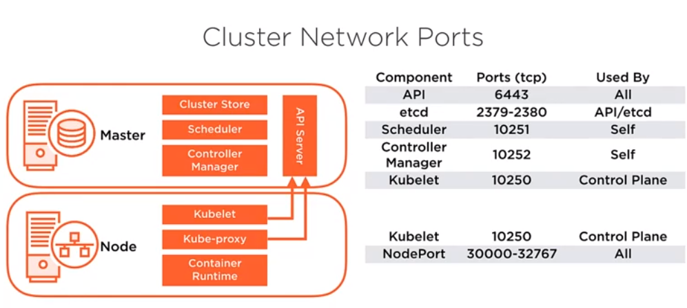

# Network
## Cluster Network Ports

## Políticas de Rede (Network Policy)
Antes de inicializar o cluster Kubernetes, a rede deve ser considerada para evitar os conflitos de IP. Existem várias opções de Pod Network, em vários níveis de desenvolvimento e feature.

* Calico - Usada em produção com software tais como Kubernetes, OpenShift, Docker Mesos e OpenStack.
* Flannel - Layer 3 IPV4 network entre os nodes e o cluster. Desenvolvida por CoreOS.
* Kube-router
* Romana
* Weave Net

[Clique aqui](https://kubernetes.io/docs/tasks/administer-cluster/network-policy-provider/) para mais informações.

## Criar uma rede "Weave Net"
Criar uma rede com kubectl usando um resource manifest, no exemplo abaixo vamos usar o Weave Net resources.

~~~sh
$ kubectl create -f https://git.io/weave-kube

# Removendo configs kubernetes
$ docker rm -f $(docker ps -aq) \
    & rm -rf /var/lib/etcd \
    & rm -rf /etc/kubernetes/
    netstat -tlpn | grep 10250
~~~
